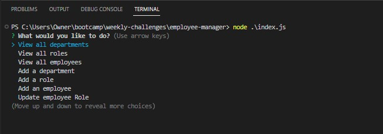

# Employee Manager

Command Line application to manage mysql employee database

## Description

The purpose of this project was to create a content management system that uses a command line interface to manage an employee database.

## Installation

N/A

## Usage

The employee manager CMS can be run in node.js by initializing the associated index.js file.  A menu will appear that will give the user the ability to arrow up and down to chose menu items to view all departments, view all roles, view all employees, add a new department, add a new role, add a new employee, and update and existing employee role.  Once a user chooses a menu option, additional user prompts will appear as needed for the selected menu option.  When a user has completed all the tasks for a given session, the user can select the "exit" menu option to exit the application.

## Credits

N/A

## License

Please refer to the LICENSE in the repo.
